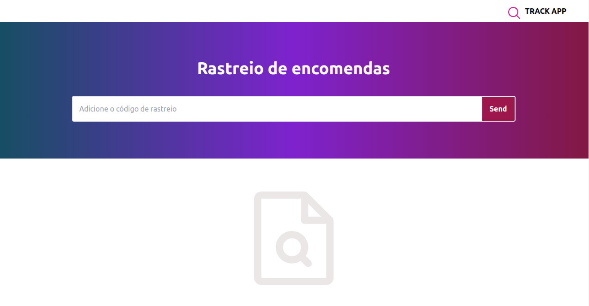
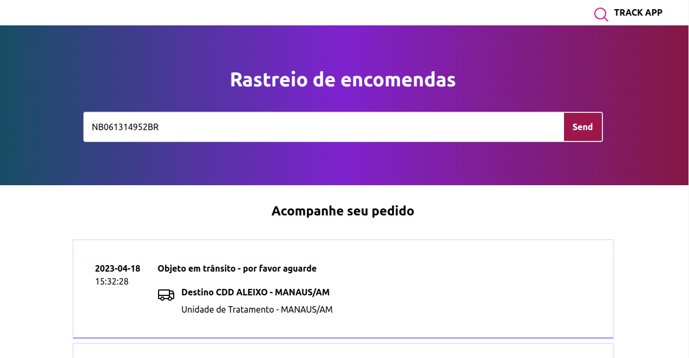
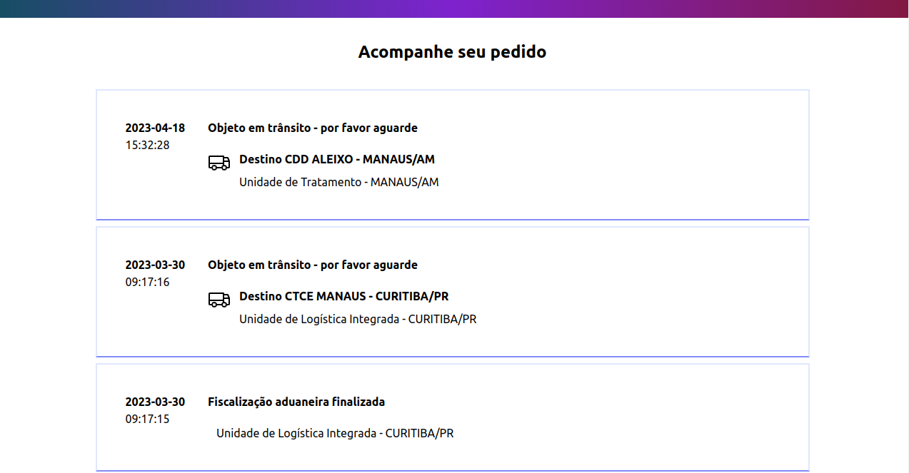

# Track-App

 

### Objetivo: Criar um rastreador de pacotes de correios, onde deve ser possível o usuario obter historico do pacote a partir de um código

 

### ⚙️ Tecnologias
- React
- TypeScript
- Vite
- Tailwind
- Zod
- React Hook Form
- Context
- Docker
- Docker-Compose
 
 

 ### 🚀 Instalação e execução com Docker
Para rodar está aplicação é necessário ter **Git**, **Node**, **Docker** e o **Docker Compose** instalados no seu computador. O Docker Compose precisa estar na versão **1.29** ou superior e o Node na versão 16.

Para conseguir executar os comandos do abaixo também é necessário que seu sistema operacional tenha um terminal Bash instalado. Caso você esteja utilizando Linux ou macOS, o Bash já vem instalado por padrão. Porém, se o seu sistema for Windows, você pode [aprender como instalar](https://dicasdeprogramacao.com.br/como-instalar-o-git-no-windows/).

## 1 - Na raíz do projeto, suba o container do frontend com o comando:

    docker-compose up -d 

O container da Web está mapeando a porta:

    - track_app_web: 3000

Para testar a aplicação você pode acessar as seguintes urls:

    - Local:   http://localhost:3000/
    - Network: http://172.19.0.2:3000/

Para parar os containers, na pasta raiz do projeto execute o comando:

    docker-compose down

 

### Regras de Negocio
 - O código de rastreio deve ter um limite de 13 caracteres
 - O código deve ser composto de 4 letras (Maiusculas) e 9 numeros
 - O código deve ter suas primeiras letras com as seguintes siglas
   PAC são EC, PD, PI, PJ e PL e o Sedex são SQ e SR
 - O código deve ter suas ultimas letras de acordo com o pais de origem ex: BR

### 💻 Funcionalidades 

 

  
🍀

